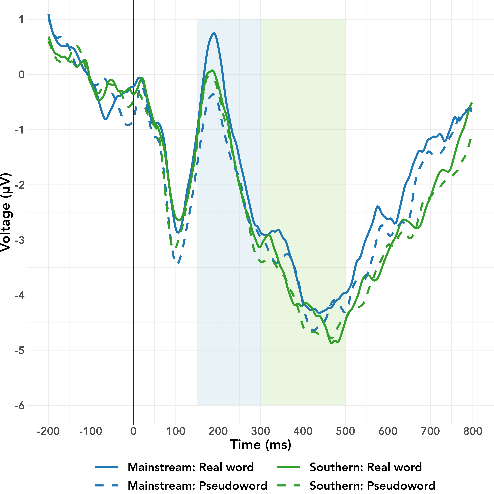

<!--     pandoc_args: [ -->
<!--       "--lua-filter", "~/Mirror/format_files/multiple-bibliographies-new.lua", -->
<!--       "--lua-filter", "/Library/Frameworks/R.framework/Versions/4.2/Resources/library/rmdfiltr/replace_ampersands.lua" -->
<!--       ] -->
<!-- bibliography: cs_project.bib -->
<!-- nocite: "@*" -->
<!-- link-citations: no -->
<!-- csl: apa7_auth.csl -->

```{r setup, include = FALSE, message = FALSE, warning = FALSE}
## R setup ##

# knitr settings
# chooseCRANmirror(graphics = FALSE, ind = 1)
knitr::opts_chunk$set(echo = FALSE, warning = FALSE, message = FALSE)
# knitr::knit_hooks$set(document  =  function(x) {sub('\\usepackage[]{color}', '\\usepackage{xcolor}', x, fixed  =  TRUE)})
```

```{r load, echo = FALSE}
source("/Users/hollyzaharchuk/Mirror/Project_VTech/exp1/analysis/5_visualize.R")
```

# Key terms

- **Dialect** is a regional variety like **Southern United States English** (SUSE)
- **Mainstream United States English** (MUSE) is perceived as "standard" by US English speakers relative to other varieties
- **Mainstream listeners** are mono-dialectal speakers of MUSE (D1)
- **Southern listeners** are bi-dialectal speakers of SUSE (D1) and MUSE (D2)

# Previously observed MUSE advantage in behavior

```{r info, out.width = "100%", out.extra = ""}
knitr::include_graphics("d1-d2.png")
```

# Auditory go/no-go task with EEG

```{r stims, out.width = "100%", out.extra = ""}
stim_tab
```

# ERP predictions and current observations

```{r sum, out.width = "100%", out.extra = ""}
pred_tab
```

# Within-dialect advantage for Mainstream listeners during lexical processing

```{r erp, out.width = "100%", out.extra = "", dpi = 300}

```

# Summary of findings and future directions

```{r final, out.width = "100%", out.extra = ""}
knitr::include_graphics("d1-d2_processing.png")
```

<div style="align: left; line-height: .3em">
  <span style="font-size: 18px"><b>References</b><br></span>
  <span style="font-size: 18px">
    Clopper, Tamati, and Pierrehumbert (2016)<br>
    Martin, Molnar, and Carreiras (2016)<br>
    Sumner, Kim, King, and  McGowan (2014)<br>
    Walker (2018)<br>
    Zaharchuk, Shevlin, and Van Hell (2021)<br>
  </span>
</div>

# P200 analysis

```{r p2_mean, out.width = "97.5%", out.extra = "", dpi = 300}
p2_fig
```

# N400 analysis

```{r n4_mean, out.width = "97.5%", out.extra = "", dpi = 300}
n4_fig
```

<!-- <div style="float: left; line-height: .5em; padding-top: 80px"> -->
<!--   <span style="font-size: 24px"><b>References</b><br></span> -->
<!--   <span style="font-size: 20px"> -->
<!--     Clopper, Tamati, and Pierrehumbert (2016)<br> -->
<!--     Martin, Molnar, and Carreiras (2016)<br> -->
<!--     Sumner, Kim, King, and  McGowan (2014)<br> -->
<!--     Walker (2018)<br> -->
<!--     Zaharchuk, Shevlin, and Van Hell (2021)<br> -->
<!--   </span> -->
<!-- </div> -->

<center></center>

<!-- <div style="clear: both;"></div> -->


